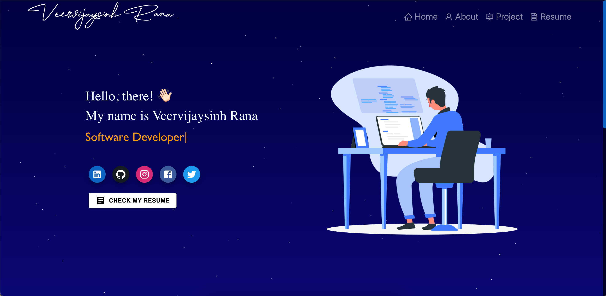

<h2 align="center">
 Portfolio Website 
  <a href="https://veervijaysinh-rana.vercel.app/" target="_blank">veervijaysinh-rana</a>
</h2>

  

 

 &nbsp;
 &nbsp;
 &nbsp;

## Built With

My professional portfolio <a href="https://veervijaysinh-rana.vercel.app/" target="_blank">veervijaysinh-rana</a> showcases a selection of my top-tier GitHub projects alongside my comprehensive resume and an overview of my technical skills.
 
This project was built using these technologies.

- `React.js`
- `Node.js`
- `CSS`
- `Material-UI`
- `React-Bootstrap`
- `Vercel`

## Features

**📖 `Multi-page Layout Featuring Navigation`**

**💡 `Crafted with React-Bootstrap and optimized with customizable color schemes.`**

**📱 `Ensuring responsiveness across various devices and screen sizes`**
